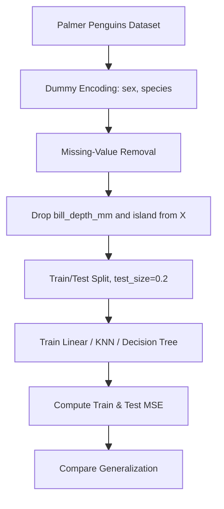
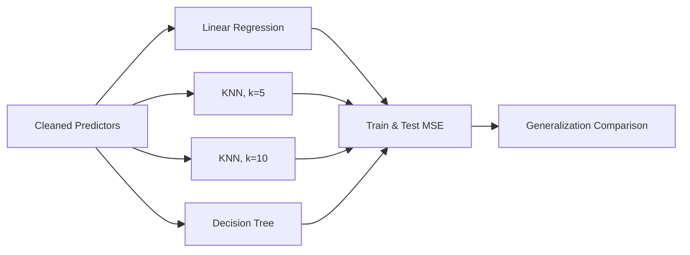
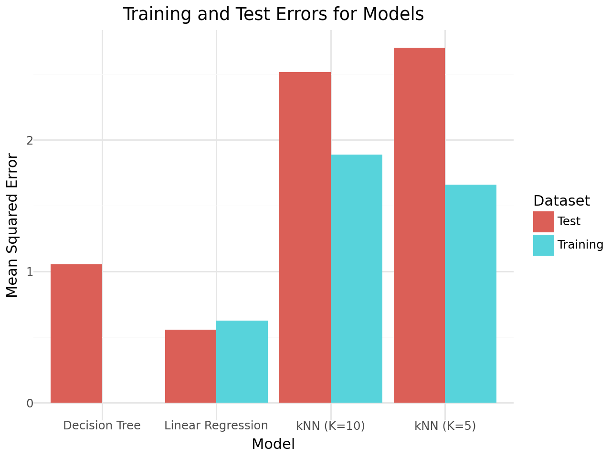

# Penguin Model Comparison


---

## Overview

This project compares multiple supervised learning models on the Palmer Penguins dataset, predicting bill depth from physical measurements and encoded categorical features.

The workflow includes:
- Loading the Palmer Penguins dataset through the `palmerpenguins` package
- Dummy encoding categorical attributes with `pd.get_dummies(..., drop_first=True)`
- Missing-value cleanup
- Training linear, instance-based, and tree-based regression models
- Mean-squared-error comparison on train and test splits
- Diagnostic visualization of overfitting and generalization

Although the repository name references species classification, the notebook is structured as a regression model-comparison exercise because it predicts `bill_depth_mm` and evaluates models with mean squared error.

---

## Project Workflow



---

# Business Problem

Comparing model families on the same dataset is a foundational machine-learning exercise — it shows how model complexity interacts with sample size and noise, and where overfitting hides.

Accurate model-comparison studies can support:
- Algorithm selection for tabular regression
- Bias-variance teaching examples
- Hyperparameter sensitivity studies (`k` in KNN)
- Generalization diagnostics on small datasets
- Ecological measurement-prediction studies

This project predicts a penguin's bill depth from the remaining cleaned features and uses model-vs-model MSE to compare three regression families.

---

# Dataset

The notebook uses the Palmer Penguins dataset through the `palmerpenguins` Python package.

| Feature | Description |
| --- | --- |
| `species` | Penguin species label (dummy-encoded as `species_Chinstrap`, `species_Gentoo`) |
| `island` | Island where the penguin was observed (dropped from predictors) |
| `bill_length_mm` | Bill length in millimeters |
| `bill_depth_mm` | Bill depth in millimeters (target) |
| `flipper_length_mm` | Flipper length in millimeters |
| `body_mass_g` | Body mass in grams |
| `sex` | Penguin sex (dummy-encoded as `sex_male`) |
| `year` | Observation year |

### Target Variable
- `bill_depth_mm` — continuous bill-depth measurement in millimeters

This is a regression problem.

---

# Exploratory Data Analysis (EDA)

### Key Insights
- Penguin species clusters strongly on bill and flipper measurements, so encoding `species` as a feature transfers a large amount of signal to the regression task
- Bill depth varies meaningfully across species and sex
- A small number of rows have missing values and are removed before modeling
- Body mass and flipper length co-vary, so a model that fits one well often fits the other

---

# Data Preprocessing

The preprocessing workflow includes:

- Removing rows with missing values
- Dummy encoding `sex` and `species` via `pd.get_dummies(..., drop_first=True)`
- Dropping `island` and the target column from the predictor matrix
- Train/test splitting (`test_size=0.2`, `random_state=42`)

### Pipeline Components
- `pandas.get_dummies` for dummy encoding (one column dropped per categorical to avoid collinearity)
- `train_test_split` from scikit-learn
- Consistent feature matrix `X` and target vector `y = bill_depth_mm`

The preprocessing layer is intentionally lightweight so the comparison reflects model behavior rather than feature-engineering effort.

---

# Model Architecture

The notebook trains three regression families on the same cleaned dataset.



### Training Configuration
- Loss / Metric: Mean Squared Error
- Models: Linear Regression, KNN Regressor (k = 5 and k = 10), Decision Tree Regressor
- Validation: held-out test split (`test_size=0.2`, `random_state=42`)
- No hyperparameter search beyond the two `k` values

---

# Model Performance

The notebook reports the following mean squared error values:

### Evaluation Metrics
- Train MSE
- Test MSE
- Train-vs-test gap (overfitting indicator)

### Reported Results

| Model | Train MSE | Test MSE |
| --- | ---: | ---: |
| Linear Regression | 0.625944 | 0.557653 |
| KNN, k=5 | 1.659056 | 2.703386 |
| KNN, k=10 | 1.888040 | 2.517257 |
| Decision Tree | 0.000000 | 1.054928 |

### Key Findings
- Linear regression produced the lowest test MSE in the recorded comparison
- The decision tree fits the training set perfectly (train MSE = 0) but generalizes worse than linear regression — a textbook overfitting case
- Both KNN settings have the largest errors overall; raising `k` from 5 to 10 trades some training fit for a smaller train-to-test gap
- The dominant signal in this dataset is linear, which is why a simple regression beats the more flexible models

### Training vs Test Error

A dodged bar chart compares training error (cyan) and test error (red) for each model side-by-side. Linear regression stays low and roughly equal on both splits — the sign of a well-generalized fit. The decision tree shows the textbook overfitting silhouette: a training bar at zero next to a much taller test bar. Both KNN settings produce the largest errors overall, with the train-to-test gap shrinking as `k` grows from 5 to 10.



---

# Model Interpretation

The notebook demonstrates how a small, clean tabular dataset can still produce a clear bias-variance story — linear regression wins by virtue of model simplicity, and the chart makes the overfitting silhouette of the decision tree immediately obvious.

Potential applications include:
- Teaching examples for bias-variance and overfitting
- Baselines for ecological-measurement regression
- Sensitivity analyses for `k` in KNN
- Comparison of model assumptions on the same feature set
- Foundations for extending into species classification

---

# Technologies Used

- Python
- pandas
- NumPy
- scikit-learn
- palmerpenguins
- plotnine
- Jupyter Notebook

---

# Repository Structure

```text
penguin-species-classification-models/
│
├── Comparing_LinearReg_DT_KNN.pynb
├── kNN_dt.html
├── images/
│   └── train-test-mse.png
└── README.md
```

---

# How to Run

1. Clone the repository
2. Install required dependencies
3. Open `Comparing_LinearReg_DT_KNN.pynb` in Jupyter Notebook, JupyterLab, or VS Code
4. Run all notebook cells sequentially

```bash
pip install pandas numpy scikit-learn plotnine palmerpenguins
```

Note: the main notebook file uses the extension `.pynb`. If your notebook environment does not recognize it, rename or copy it with an `.ipynb` extension before opening.

---

# Future Improvements

- Rename the notebook extension from `.pynb` to `.ipynb`
- Clarify the repository goal by choosing either species classification or bill-depth regression
- If predicting species, switch to classification metrics (accuracy, F1, confusion matrix)
- Add visualizations of species clusters by bill and flipper measurements
- Cross-validate the KNN `k` selection rather than picking two fixed values

---

# Author

**Pranika Chandra**  
Projects focused on machine learning, regression model comparison, generalization diagnostics, and applied data science.
